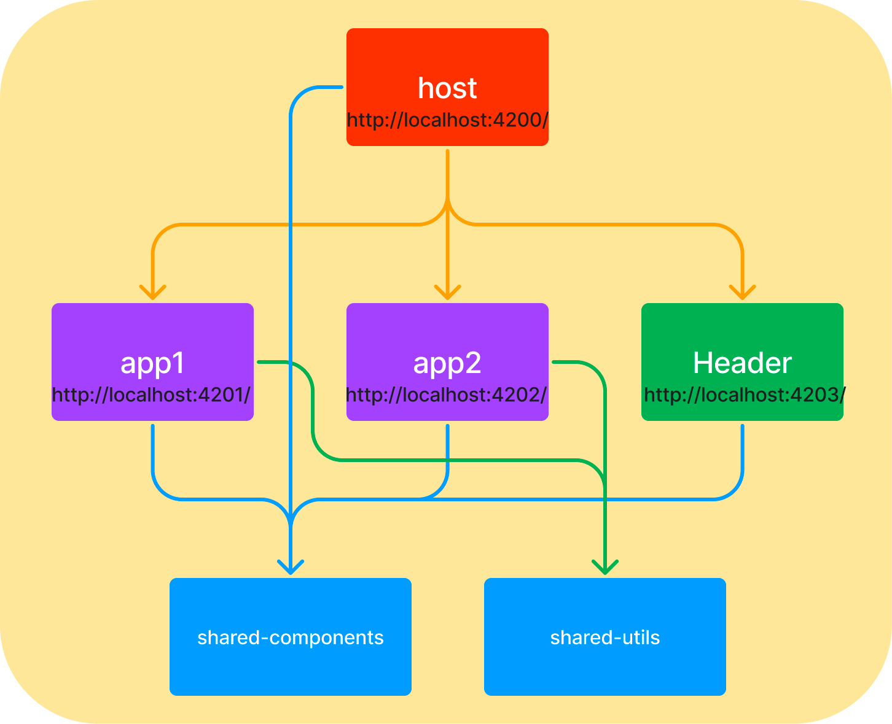
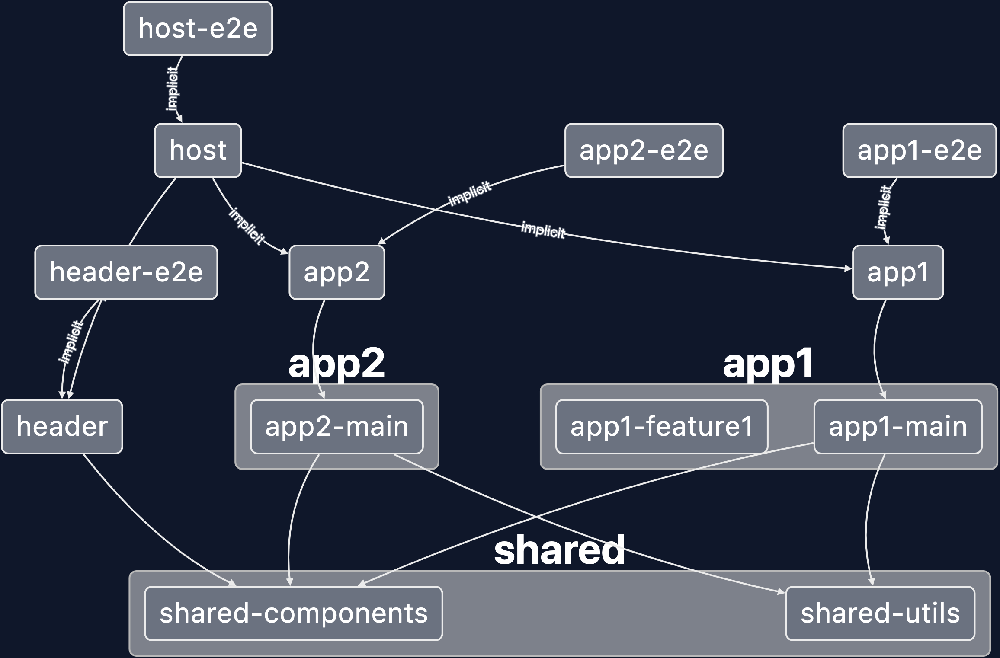

<div id="top"></div>

[![Contributors][contributors-shield]][contributors-url]
[![Forks][forks-shield]][forks-url]
[![Stargazers][stars-shield]][stars-url]
[![Issues][issues-shield]][issues-url]
[![MIT License][license-shield]][license-url]
[![LinkedIn][linkedin-shield]][linkedin-url]


<!-- PROJECT LOGO -->
<br />
<div align="center">
  <a href="https://github.com/juicyjusung/juicy-mfe">
    
  </a>

<h3 align="center">juicy-mfe</h3>

  <p align="center">
    Module Federation을 이용한 Micro Frontend(마이크로 프론트엔드) 아키텍쳐 Monorepo 연습장 입니다.
    <br />
    <a href="https://github.com/juicyjusung/juicy-mfe"><strong>Explore the docs »</strong></a>
    <br />
    <br />
    <a href="https://github.com/juicyjusung/juicy-mfe">View Demo</a>
    ·
    <a href="https://github.com/juicyjusung/juicy-mfe/issues">Report Bug</a>
    ·
    <a href="https://github.com/juicyjusung/juicy-mfe/issues">Request Feature</a>
  </p>
</div>


<!-- TABLE OF CONTENTS -->
<details>
  <summary>Table of Contents</summary>
  <ol>
    <li>
      <a href="#about-the-project">About The Project</a>
      <ul>
        <li><a href="#built-with">Built With</a></li>
      </ul>
    </li>
    <li>
      <a href="#getting-started">Getting Started</a>
      <ul>
        <li><a href="#prerequisites">Prerequisites</a></li>
        <li><a href="#installation">Installation</a></li>
      </ul>
    </li>
    <li><a href="#usage">Usage</a></li>
    <li><a href="#roadmap">Roadmap</a></li>
    <li><a href="#contributing">Contributing</a></li>
    <li><a href="#license">License</a></li>
    <li><a href="#contact">Contact</a></li>
    <li><a href="#acknowledgments">Acknowledgments</a></li>
  </ol>
</details>


<!-- ABOUT THE PROJECT -->
## About The Project


Micro Frontend


<p align="right">(<a href="#top">back to top</a>)</p>


### Built With

* [Nx](https://nx.dev/)
* [React.js](https://reactjs.org/)
* [MUI](https://mui.com/)
* [Typescript](https://mui.com/)


<p align="right">(<a href="#top">back to top</a>)</p>


<!-- GETTING STARTED -->
## Getting Started



MFE(Micro Frontend)를 구현하는 방법은 다양 합니다 (빌드타임 통합, iframe, 웹뷰 등).  본 프로젝트는 그 중 런타임에 애플리케이션(번들)들이 통합 될 수 있는 webpack5의 module federation을 이용합니다.
nx의 플러그인을 활용하여 빠르게 Module Federation MFE를 구현하는 예제 입니다.

- [Host]
  - host - (port: 4200)

- [Remotes]
  - app1 - (port: 4201)
  - app2 - (port: 4202)
  - header - (port: 4203)

- [Shared Library]
  - shared/components
  - shared/utils

- Host, Remotes 앱은 각각 독립적으로 실행이 가능하며 런타임에 통합될 수 있습니다.
  - 즉, 수정 사항이 발생한 앱만 빌드 및 배포 하여도 해당 앱을 사용하는 Host 앱들은 빌드, 배포가 필요하지 않습니다.
- 공통으로 사용되는 라이브러리들은 빌드 타임에 통합합니다.


### Prerequisites

> pnpm
> 
> workspace.json에서 프로젝트 네임 확인

### Installation

1. repo를 clone한다.
   ```sh
   git clone https://github.com/juicyjusung/juicy-mfe.git
   ```
2. pacakges 설치한다.
   ```sh
   cd juicy-mfe
   pnpm install
   ```

<p align="right">(<a href="#top">back to top</a>)</p>


<!-- USAGE EXAMPLES -->
## Usage

### 서버 실행
> **nx serve [앱]**
```sh
// 호스트 serve
nx serve host

// 리모트 개발 서버 
nx serve host --open --devRemotes=app1,app2
```

### 테스트 (unit/E2E)

#### unit test

> **nx test [프로젝트(앱/라이브러리)명]**
>

```bash
nx test host
nx test app1

// watch option
nx test host --watch
nx test shared-components --watch

// many
nx run-many --target=test --all
nx run-many --target=test --projects=app1,app2
nx run-many --target=test --projects=app1,app2 --parallel=2

```

#### e2e test

> **nx e2e [프로젝트(앱/라이브러리)명]**
>

```bash
// Headless Mode
nx e2e host-e2e

// Headed Mode
nx e2e app1-e2e --watch

// Testing Against Prod Build
nx e2e host-e2e --prod

// many
nx run-many --target=e2e --all
nx run-many --target=e2e --projects=app1-e2e,app2-e2e

```

### project, lib 추가

앱 추가

```bash
[Module Federation]
// host 추가 (react)
nx g @nrwl/react:host host --remotes=shop,cart,about

// remote 추가 (react)
nx g @nrwl/react:remote shop --host=host
```

라이브러리 추가

```bash
nx g lib [라이브러리 명]

// ex) 리액트 라이브러리 추가
nx g @nrwl/react:library shared/ui
```

라이브러리 삭제

```bash
nx g remove [라이브러리 명]

nx g remove [라이브러리 명] --forceRemove

// ex
nx g remove shared-ui
```


### 빌드
```sh
nx run-many --target=build --all
```

### Graph

```sh
nx graph
```

### CI

코드 수정에 따라 영향을 받는 프로젝트만 lint, test, build, e2e 를 진행합니다.

- nrwl/ci/.github/workflows/nx-cloud-main.yml@v0.2
- nrwl/ci/.github/workflows/nx-cloud-agents.yml@v0.2


<p align="right">(<a href="#top">back to top</a>)</p>


<!-- ROADMAP -->
## Roadmap

- [ ] 스토리북 추가
- [ ] 다른 프레임웤/라이브러리(Vue, Angular 등) 추가
- [ ] deploy

See the [open issues](https://github.com/juicyjusung/juicy-mfe/issues) for a full list of proposed features (and known issues).

<p align="right">(<a href="#top">back to top</a>)</p>


<!-- CONTACT -->
## Contact

juicyjusung - juicyjusung@gmail.com

Project Link: [https://github.com/juicyjusung/juicy-mfe](https://github.com/juicyjusung/juicy-mfe)

<p align="right">(<a href="#top">back to top</a>)</p>


<!-- MARKDOWN LINKS & IMAGES -->
<!-- https://www.markdownguide.org/basic-syntax/#reference-style-links -->
[contributors-shield]: https://img.shields.io/github/contributors/juicyjusung/juicy-mfe.svg?style=for-the-badge
[contributors-url]: https://github.com/juicyjusung/juicy-mfe/graphs/contributors
[forks-shield]: https://img.shields.io/github/forks/juicyjusung/juicy-mfe.svg?style=for-the-badge
[forks-url]: https://github.com/juicyjusung/juicy-mfe/network/members
[stars-shield]: https://img.shields.io/github/stars/juicyjusung/juicy-mfe.svg?style=for-the-badge
[stars-url]: https://github.com/juicyjusung/juicy-mfe/stargazers
[issues-shield]: https://img.shields.io/github/issues/juicyjusung/juicy-mfe.svg?style=for-the-badge
[issues-url]: https://github.com/juicyjusung/juicy-mfe/issues
[license-shield]: https://img.shields.io/github/license/juicyjusung/juicy-mfe.svg?style=for-the-badge
[license-url]: https://github.com/juicyjusung/juicy-mfe/blob/master/LICENSE.txt
[linkedin-shield]: https://img.shields.io/badge/-LinkedIn-black.svg?style=for-the-badge&logo=linkedin&colorB=555
[linkedin-url]: https://linkedin.com/in/linkedin_username
[product-screenshot]: images/screenshot.png
